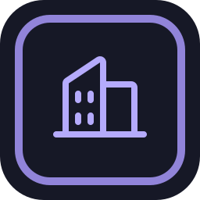
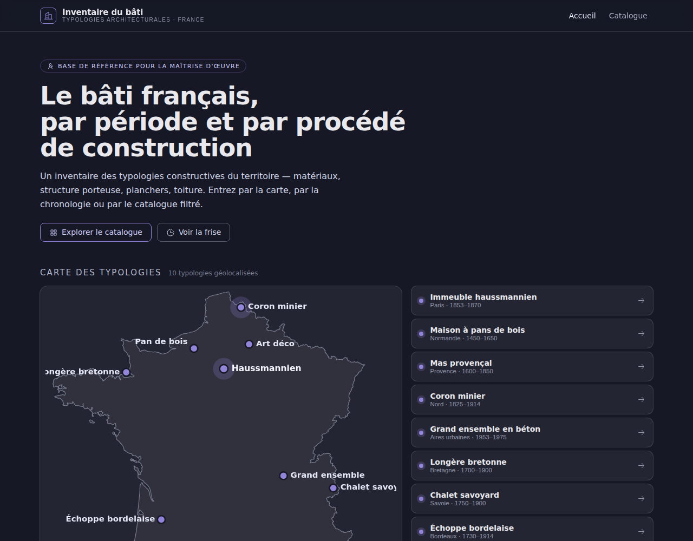
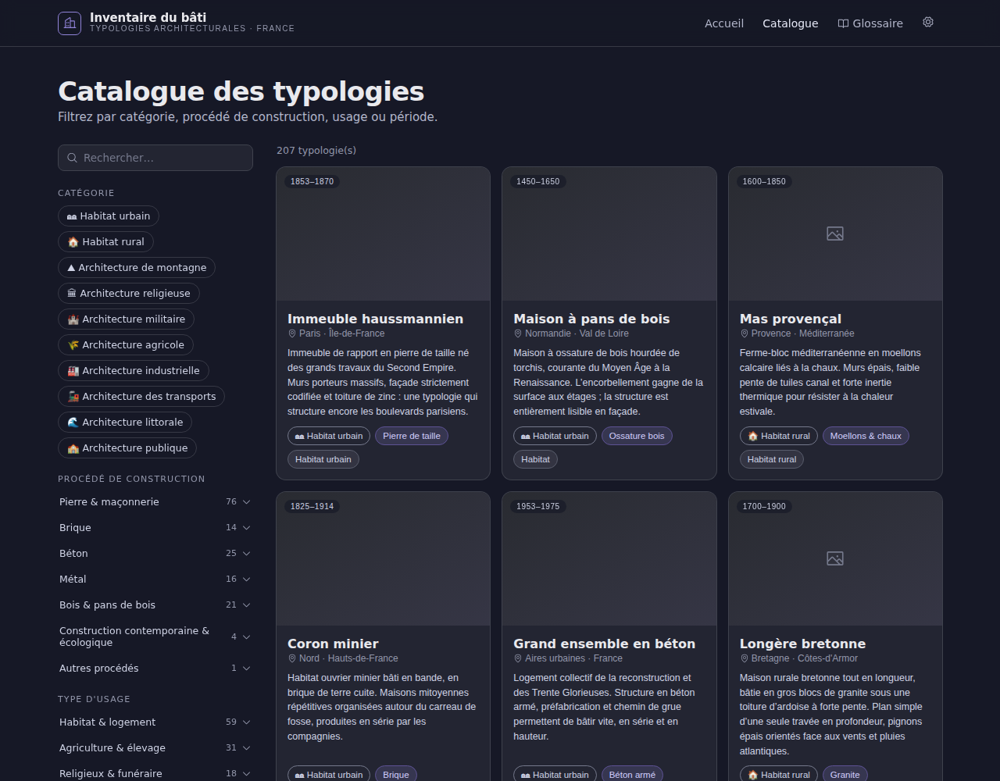
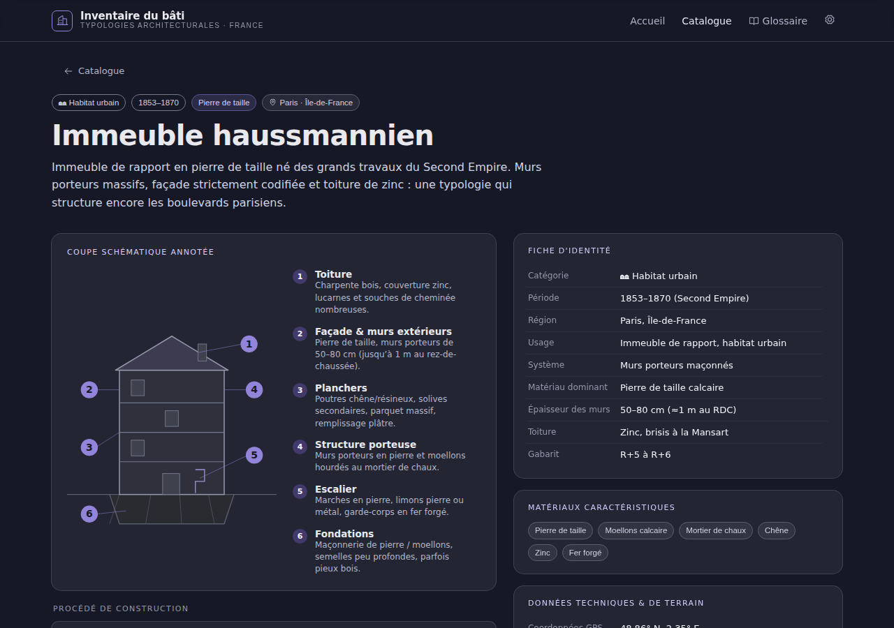

# 🏛️ Inventaire du bâti — Typologies architecturales françaises

<div align="center">



<br/>

[](https://github.com/nouhailler/architecturor/blob/main/LICENSE) 
[](https://github.com/nouhailler/architecturor/releases) 
[](https://github.com/nouhailler/architecturor/actions) 
[](https://codecov.io/gh/nouhailler/architecturor) 
[](https://github.com/nouhailler/architecturor/stargazers)

[](https://react.dev)
[](https://www.typescriptlang.org)
[](https://vitejs.dev)

</div>

---

## ✨ À propos

Inventaire du bâti est une base de référence destinée à la maîtrise d'œuvre : elle recense **219 typologies constructives françaises** (immeuble haussmannien, mas provençal, maison à pans de bois, grand ensemble, bastide, borie, pigeonnier, grange à fenil, village perché, etc.) réparties en 10 catégories (rural, urbain, religieux, militaire, industriel, transports, agricole, public, littoral, montagne), avec pour chacune : structure porteuse, matériaux, planchers, toiture — et, pour la plupart, une photo.

Points d'entrée principaux :
- 🗺️ Carte de France géolocalisant chaque typologie
- ⏳ Frise chronologique (1400 → 2000)
- 🔍 Catalogue filtrable (procédé de construction, usage, période, catégorie)
- 📖 Glossaire des termes d'architecture et de construction
- ⚙️ Paramètres : export JSON du catalogue, import de vos propres typologies

## Table des matières

- [Aperçu / Démo](#aperçu--démo)
- [Features](#features)
- [Installation](#installation)
- [Usage](#usage)
- [📲 Progressive Web App](#-progressive-web-app)
- [Structure du projet](#structure-du-projet)
- [Données et contenu](#données-et-contenu)
- [Contribuer](#contribuer)
- [Tests & CI](#tests--ci)
- [Licence](#licence)
- [Contact & crédits](#contact--crédits)

## 📸 Aperçu / Démo

Capture d'écran et exemple animé :

| Accueil | Catalogue | Fiche détail |
|---:|:---:|:---:|
|  |  |  |

Démo animée (exemple) :  


Remarques :
- Si vous n'avez pas encore de GIF, ajoutez docs/demo/demo.gif (capture animée ~5–10s).
- Pensez à fournir des alternatives (alt text) accessibles pour chaque image.

## Features

- ✅ 219 typologies documentées, sur 10 catégories (rural, urbain, religieux, militaire,
  industriel, transports, agricole, public, littoral, montagne)
- ✅ Catalogue filtrable par catégorie, période, procédé, usage, avec recherche texte
- ✅ Carte interactive et frise chronologique des typologies
- ✅ Fiches détaillées avec coupes annotées, procédé de construction en accordéon
- ✅ Photos Wikimedia Commons pour la majorité des typologies (vignettes + galerie)
- ✅ Glossaire des termes d'architecture, recherche incluse
- ✅ Export JSON de tout le catalogue et import de vos propres typologies (avec gabarit,
  validation et détection de doublons), stockées localement — pas de backend
- ✅ Thème sombre / design tokens
- ✅ Données en TypeScript (`src/data/typologies.ts`) comme source de vérité
- ✅ **Installable en PWA** 📲 — icône dédiée sur l'écran d'accueil (mobile & desktop), lancement en mode autonome (`standalone`), sans barre d'adresse

## 🚀 Installation

Prérequis : Node.js (>= 18), npm ou pnpm

```bash
# cloner
git clone https://github.com/nouhailler/architecturor.git
cd architecturor

# installer dépendances
npm install

# dev
npm run dev

# build prod
npm run build

# prévisualiser le build
npm run preview
```

Tips :
- Pour pnpm : pnpm install
- Ajoutez un .env.local si vous avez des clés (ex. API maps) — voir [Configuration](#configuration)

## 🧭 Usage rapide

- Accéder à http://localhost:5173 (ou l'URL indiquée par Vite)
- Ouvrir la carte pour filtrer par régions / période
- Cliquer sur une typologie pour ouvrir la fiche détaillée

## 📲 Progressive Web App

L'application est **installable** comme une app native, sur mobile comme sur desktop, avec sa propre icône et un lancement sans barre d'adresse (`display: standalone`).

<div align="center">

| 🖼️ Icône (192×192) | 🎭 Maskable (Android) | 🍎 Apple Touch Icon |
|:---:|:---:|:---:|
|  |  |  |

</div>

| Fichier | Rôle |
|---|---|
| `public/manifest.webmanifest` | Manifeste PWA — nom, couleurs, icônes, mode d'affichage |
| `public/pwa-192.png`, `public/pwa-512.png` | Icônes d'installation (Android, desktop) |
| `public/pwa-maskable-512.png` | Variante *maskable* (fond plein bord à bord, respecte la zone de sécurité pour le découpage adaptatif Android) |
| `public/apple-touch-icon.png` | Icône 180×180 pour « Ajouter à l'écran d'accueil » sur iOS/iPadOS |
| `public/icon.svg`, `public/icon-maskable.svg` | Sources vectorielles des icônes ci-dessus |

**Installer l'app :**
- 🖥️ Chrome/Edge desktop : icône ⊕ dans la barre d'adresse, ou menu → *Installer Inventaire du bâti*
- 📱 Android (Chrome) : menu ⋮ → *Ajouter à l'écran d'accueil*
- 📱 iOS/iPadOS (Safari) : bouton *Partager* → *Sur l'écran d'accueil*

**Régénérer les icônes** après modification de `public/icon.svg` (nécessite `cairosvg`, `pip install cairosvg`) :

```bash
python3 -c "
import cairosvg
for size in (192, 512):
    cairosvg.svg2png(url='public/icon.svg', write_to=f'public/pwa-{size}.png', output_width=size, output_height=size)
cairosvg.svg2png(url='public/icon-maskable.svg', write_to='public/pwa-maskable-512.png', output_width=512, output_height=512)
cairosvg.svg2png(url='public/icon-maskable.svg', write_to='public/apple-touch-icon.png', output_width=180, output_height=180)
"
```

> ℹ️ Il n'y a pas de service worker : la PWA est installable et fonctionne comme un onglet dédié, mais **ne fonctionne pas hors-ligne**. C'est un choix délibéré tant que l'app ne charge que des ressources statiques et des images distantes (Wikimedia Commons) — voir [CONTEXT.md](CONTEXT.md) pour les limitations connues.

## 🗂️ Structure du projet

Arborescence principale (extrait) :

```
src/
├── components/       # Composants réutilisables (Header, Footer, Modal)
├── pages/
│   ├── Accueil/      # Carte de France + frise chronologique
│   ├── Catalogue/    # Liste filtrable des typologies
│   ├── FicheDetail/  # Fiche par typologie (coupe, procédé, identité)
│   ├── Glossaire/    # Lexique des termes d'architecture
│   └── Parametres/   # Export JSON, import de typologies personnalisées
├── context/          # App context : filtres, recherche
├── data/
│   ├── typologies.ts      # 219 typologies natives — source de vérité
│   ├── typologieSchema.ts # Gabarit + validation des typologies importées
│   ├── glossaire.ts       # Termes du glossaire
│   └── icons.tsx          # Mappage icônes → composants Phosphor
├── utils/
│   ├── commons.ts          # Résolution des URLs d'images Wikimedia Commons
│   ├── duplicates.ts       # Détection de doublons à l'import
│   └── customTypologies.ts # Persistance localStorage des typologies importées
├── styles/           # Tokens & styles globaux
└── docs/             # Screenshots, demo GIFs, documentation

public/
├── icon.svg               # Favicon / logo source
├── icon-maskable.svg       # Source de l'icône maskable (fond plein bord à bord)
├── manifest.webmanifest    # Manifeste PWA
├── pwa-192.png, pwa-512.png, pwa-maskable-512.png  # Icônes d'installation
└── apple-touch-icon.png    # Icône iOS/iPadOS
```

## 🧾 Données & contenu

- Les 219 typologies natives sont définies dans `src/data/typologies.ts` — format TypeScript
  pour assurer la cohérence (voir la section « Modèle de données » de [CONTEXT.md](CONTEXT.md)
  pour le détail des champs).
- La plupart référencent une photo Wikimedia Commons (`images: string[]`), résolue à l'affichage
  par `src/utils/commons.ts` — aucune image n'est copiée dans le dépôt.
- Vous pouvez enrichir le catalogue sans toucher au code : page **Paramètres** → coller ou
  importer un JSON respectant le gabarit fourni. La typologie est validée, vérifiée contre les
  doublons, puis stockée dans votre navigateur (`localStorage`) et visible immédiatement dans le
  catalogue et les fiches. L'export JSON permet de récupérer l'ensemble (natives + importées) à
  tout moment.

## 🛠️ Stack technique

- React 18 + TypeScript
- Vite
- React Router
- Phosphor Icons
- CSS Modules (design tokens dans src/styles)

## Tests, CI & Qualité

- Ajouter un workflow GitHub Actions (ex. .github/workflows/ci.yml) pour :
  - lint (eslint)
  - build
  - tests (vitest / jest si présents)
  - coverage (upload vers Codecov)

Exemple de badge CI (remplacer le nom du workflow / branche si besoin) :

```
[](https://github.com/nouhailler/architecturor/actions)
```

Coverage (exemple Codecov) :

```
[](https://codecov.io/gh/nouhailler/architecturor)
```

## 🔧 Configuration

- Fichiers d'environnement : .env.example
- Clés externes :
  - API carte (ex. Mapbox, Leaflet + tiles) — définissez MAP_API_KEY dans .env.local
- Personnalisation du thème : src/styles/tokens.css

## 🧩 Déploiement

- Hébergement recommandé : Netlify, Vercel ou GitHub Pages (build statique).
- Exemple (Vercel) : branch main → déploiement automatique.
- Pour GitHub Pages, configurer la cible de build et la branche gh-pages.

## 🤝 Contribuer

Merci pour votre intérêt ! Quelques règles pour contribuer :

1. Forkez le dépôt et créez une branche feature/bugfix : git checkout -b feat/ma-feature
2. Respectez les conventions (lint + formatting)
3. Ouvrez une Pull Request claire avec description & capture d'écran
4. Pour les contributions de données (typologies) dans `src/data/typologies.ts` :
   - `id` en minuscules sans séparateur, unique dans le fichier ;
   - respectez le format `Typologie` (voir le gabarit `TYPOLOGIE_TEMPLATE` dans
     `src/data/typologieSchema.ts`, aussi téléchargeable depuis la page Paramètres) ;
   - vérifiez qu'il ne s'agit pas d'un doublon d'une typologie existante (nom, catégorie, région,
     usage, période) ;
   - si vous ajoutez une image, référencez un fichier Wikimedia Commons sous licence libre
     (`images: ['Nom_du_fichier.jpg']`) et vérifiez-le visuellement avant de l'intégrer ;
   - `npm run build` (tsc + vite build) doit passer sans erreur.

Template de PR suggéré :
- Contexte / problème résolu
- Ce qui a été modifié
- Screenshots / GIFs (si UI)
- Checklist (lint, build, tests)

## 📄 Licence

Remplacez par la licence effective si différente. Exemple MIT :

```
MIT © Nouhailler
```

Badge licence :

```
[](https://github.com/nouhailler/architecturor/blob/main/LICENSE)
```

## ✉️ Contact & crédits

- Auteur : nouhailler — https://github.com/nouhailler
- Contact : (mettez votre email / profil)
- Inspirations et ressources :
  - Phosphor Icons — https://phosphoricons.com
  - Vite — https://vitejs.dev

---

Notes / To‑do suggérées (optionnelles)
- [ ] Ajouter un GIF de démonstration dans docs/demo/demo.gif
- [ ] Mettre en place GitHub Actions (ci.yml) et lier Codecov
- [ ] Compléter le fichier LICENSE si absent
- [ ] Ajouter badges pour issues ouvertes, dependabot, et release cadence
